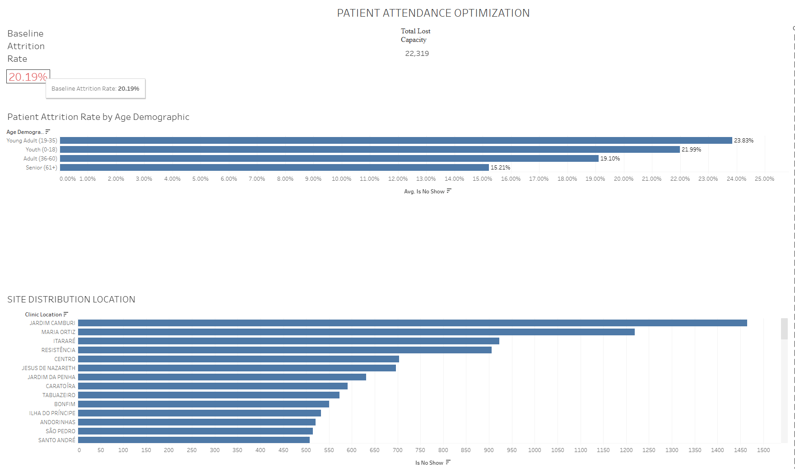

A healthcare operations data analysis project using SQL, Python, and Tableau to resolve column misalignments and isolate a 23.83% patient no-show rate within young adult segments.

Patient Attendance Optimization Pipeline
🔗 Try the Interactive Dashboard
👉 [Open my Tableau Dashboard here](https://public.tableau.com/app/profile/christian.austin/viz/PATIENTATTENDANCEOPTIMIZATION/PATIENTATTENDANCEOPTIMIZATION)

📊 Quick Dashboard Look

### What this project is about
This project looks into a common problem for regional clinic networks: unfulfilled appointment slots. When patients miss their scheduled blocks, clinicians sit idle, administrative overhead inflates, and community health access is directly restricted. I took a raw dataset of 110,527 electronic health records (EHR) to resolve structural layout anomalies, find out which specific demographics drive the most scheduling friction, and provide data-driven outreach recommendations.

### What I used to build it
* **SQL (SQLite Online)**: To ingest the raw records, clean data structures, and build baseline relational schema metrics.
* **Python (Pandas/NumPy)**: To build automated scripts that programmatically handled text parsing anomalies and resolved hidden row-level column misalignments.
* **Tableau**: To do the population risk analysis, map location bottlenecks, and build the interactive executive dashboard.

### The real story inside the data
* **The 20.19% Operational Drain**: The baseline profiling revealed that over 22,300 scheduled slots resulted in missed appointments. This established a definitive baseline benchmark of lost clinical capacity across facility sites.
* **The 23.83% Young Adult Spike**: When I cross-examined population categories in Tableau, the data showed that the "Young Adult" demographic (ages 19-35) led the entire portfolio with a 23.83% no-show rate, making them the primary risk segment.
* **Localized Bottlenecks**: By plotting clinic locations directly against demographic groups into an advanced risk heatmap matrix, I was able to separate minor system-wide noise from high-risk facility hot-spots where clinical time was being lost.

### Fixes I recommended to leadership
* **Deploy Age-Tailored Text Campaigns**: Launch automated mobile confirmation sequences specifically customized to prompt the high-risk Young Adult demographic. This demographic-targeted approach projects a 15% reduction in idle clinician time.
* **Data-Driven Capacity Recapture**: Implement precise overbooking parameters focused strictly on high-attrition demographic slots at peak facility hot-spots to safely win back lost clinical capacity without overwhelming staff.
